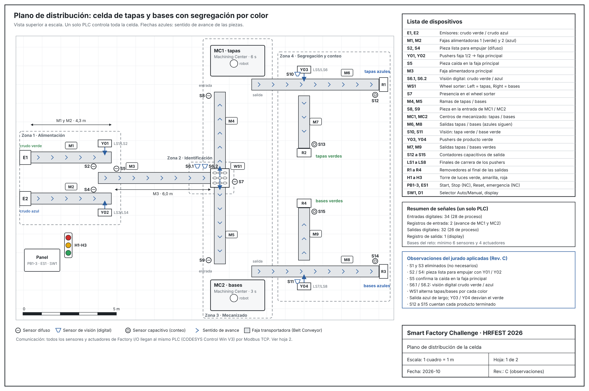
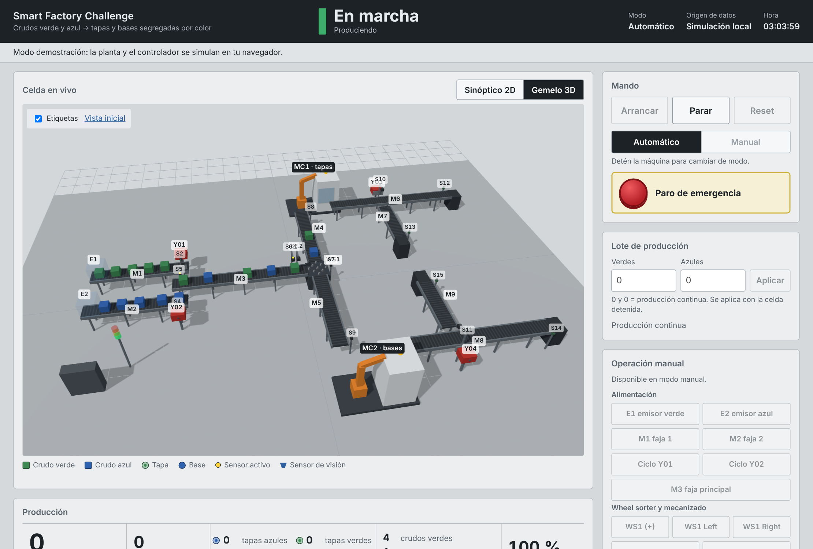
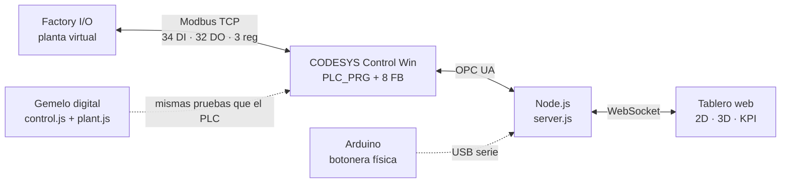

<div align="center">

## Qué hace

Dos emisores alimentan **crudo verde** (faja 1) y **crudo azul** (faja 2). Los pushers Y01 e Y02
los transfieren por turnos a la faja principal y **S5** confirma cada caída. Los sensores de visión
**S6.1/S6.2** identifican el color y el **wheel sorter** aplica la regla del jurado: el primer crudo
de cada color va a **tapas**, el siguiente a **bases**, y así sucesivamente. Dos **centros de
mecanizado** fabrican tapas (MC1) y bases (MC2). A la salida, el producto **azul sigue de largo** y
el **verde se desvía** con un pusher; cuatro **sensores capacitivos** cuentan tapas y bases de cada color.



| Requisito de las bases            | Cómo se cumple                                                                                           |
| --------------------------------- | --------------------------------------------------------------------------------------------------------- |
| Mínimo 6 sensores y 4 actuadores | **28 sensores** y **26 actuadores** de proceso, más panel ([mapa de E/S](docs/02-mapa-io.md)) |
| Control en PLC virtual            | CODESYS Control Win V3, 100 % Structured Text, un solo PLC                                                |
| Protocolo OPC UA o Modbus TCP     | **Ambos**: Modbus TCP con la planta, OPC UA con el tablero                                          |
| Operación manual / automática   | Selector físico y desde el tablero, con permisivos por estado                                            |
| Paro de emergencia y Reset        | Contactos NC fail-safe, 24 alarmas enclavadas, rearme solo sin causa                                      |
| Tablero de control en tiempo real | Sinóptico 2D,**gemelo 3D**, alarmas, lote, KPI y ocupación de máquinas                           |

Cada observación del jurado (S1 y S3 eliminados, S2/S4, S5, S6.1/S6.2, wheel sorter con regla
por color, máquinas de tapas/bases, segregación y conteo) está trazada a su código y a su prueba en
[docs/00-bases-y-correcciones.md](docs/00-bases-y-correcciones.md).

## Cómo responde a la evaluación

| Criterio                | Peso | Evidencia                                                                                                                                      |
| ----------------------- | ---- | ---------------------------------------------------------------------------------------------------------------------------------------------- |
| Funcionalidad y lógica | 30 % | Máquina de estados, unión con turno y confirmación, regla del sorter verificada pieza por pieza, lote X/Y, 24 alarmas con causa y solución |
| Complejidad y HMI       | 20 % | 34 entradas, 32 salidas, 3 registros; wheel sorter y centros de mecanizado; tablero ISA-101 con gemelo 3D                                      |
| Calidad del código     | 20 % | IEC 61131-3 en ST: 8 FB reutilizables en arreglos, enums estrictos, GVL por función, sin números mágicos; 18 pruebas automáticas en CI     |
| Optimización           | 15 % | **14,2 productos/min = 99 % del máximo teórico** que impone MC1; fajas por demanda ([análisis](docs/09-optimizacion.md))               |
| Sustentación           | 15 % | [Guion de 5 minutos](docs/05-video-y-final.md) y [protocolo de pruebas](docs/06-pruebas.md)                                                      |

## Inicio rápido: la demo en 1 minuto

Requisitos: [Node.js 18+](https://nodejs.org) y [VS Code](https://code.visualstudio.com).

```bash
git clone https://github.com/TU-USUARIO/smart-factory-challenge.git
cd smart-factory-challenge/hmi
npm install
npm run demo
```

Abre [http://localhost:3000](http://localhost:3000). La planta y el controlador se simulan; cambia a **Gemelo 3D**, prueba
un lote de X verdes e Y azules o usa *Pruebas de falla* para provocar atascos, pushers trabados o
una puerta abierta.

**En VS Code:** abre la carpeta del repositorio, instala las extensiones recomendadas y pulsa
**F5** con *"Demo: planta simulada"*. En *Terminal > Run Task* están las demás tareas (pruebas,
PLC simulado, regenerar planos).



## Puesta en marcha completa (PLC + planta)

| Paso                                            | Guía                                                     |
| ----------------------------------------------- | --------------------------------------------------------- |
| 1. Construir la escena en Factory I/O           | [docs/03-escena-factoryio.md](docs/03-escena-factoryio.md) |
| 2. Crear el proyecto CODESYS y pegar el código | [docs/04-codesys.md](docs/04-codesys.md)                   |
| 3. Conectar el tablero al PLC                   | abajo                                                     |
| 4. Grabar el video                              | [docs/05-video-y-final.md](docs/05-video-y-final.md)       |

```bash
cd hmi
cp .env.example .env      # en Windows: copy .env.example .env
npm start                 # se conecta a opc.tcp://localhost:4840
```

Si no encuentra las variables, ejecuta `npm run browse` para ver el nombre del dispositivo OPC UA.
Para probar la ruta OPC UA sin CODESYS: `npm run mock-plc` en una terminal y `npm start` en otra.

## Arquitectura



Detalle de zonas, bloques, estados y decisiones de diseño en [docs/01-arquitectura.md](docs/01-arquitectura.md).
Plano de hardware y asignación de E/S: [docs/img/plano-hardware.png](docs/img/plano-hardware.png).

## Estructura del repositorio

```
smart-factory-challenge/
├── plc/codesys/          Código IEC 61131-3 (ST), listo para pegar en CODESYS
│   ├── 01_DUT/           Enumeraciones (estado, color, rama, pasos) y estructuras
│   ├── 02_GVL/           E/S, HMI, parámetros y alarmas
│   ├── 03_FUN/           Color desde visión y colas FIFO
│   ├── 04_FB/            Pusher, faja, estación de alimentación, wheel sorter,
│   │                     centro de mecanizado, desviador por color, alarmas, KPI
│   ├── 05_PRG/           PLC_PRG: máquina de estados y las 4 zonas
│   └── project/          Proyecto .project de CODESYS
├── hmi/                  Tablero SCADA web (Node.js + OPC UA + WebSocket)
│   ├── public/js/        Interfaz, sinóptico 2D, gemelo 3D, espejo del PLC, planta, mapa de E/S
│   ├── src/              Cliente OPC UA, mapa de tags, PLC simulado, puente Arduino
│   └── tests/            Pruebas de lógica y de coherencia con el código del PLC
├── factoryio/            Escena .factoryio
├── arduino/              Botonera física opcional
├── tools/                Generadores del plano, del mapa de E/S y de los diagramas
└── docs/                 Bases y correcciones, arquitectura, E/S, guías, pruebas, planos, GitHub
```

## Documentación

|                                                           |                                                                      |
| --------------------------------------------------------- | -------------------------------------------------------------------- |
| [0. Bases y correcciones](docs/00-bases-y-correcciones.md) | Matriz de trazabilidad: cada observación → código → prueba       |
| [1. Arquitectura](docs/01-arquitectura.md)                 | Zonas, componentes, bloques, estados, seguimiento, decisiones        |
| [2. Mapa de E/S](docs/02-mapa-io.md)                       | Las 69 señales con dirección Modbus, variable y tag de Factory I/O |
| [3. Escena Factory I/O](docs/03-escena-factoryio.md)       | Piezas, posiciones, driver y ajustes                                 |
| [4. CODESYS](docs/04-codesys.md)                           | Proyecto, Modbus, importación del código, OPC UA                   |
| [5. Video y final](docs/05-video-y-final.md)               | Guion de 5 minutos y plan para la Escena Secreta                     |
| [6. Pruebas](docs/06-pruebas.md)                           | Pruebas automáticas y protocolo en planta                           |
| [7. GitHub y equipo](docs/07-github-y-colaboracion.md)     | Colaboradores, ramas protegidas, flujo de trabajo                    |
| [8. Planos y diagramas](docs/08-diagramas.md)              | Plano de distribución, plano de hardware y 10 diagramas             |
| [9. Optimización](docs/09-optimizacion.md)                | Cuello de botella y productos por minuto                             |

## Pruebas

```bash
cd hmi && npm test
```

18 pruebas: la secuencia completa, la regla del wheel sorter pieza por pieza, la unión, el lote,
parada controlada, emergencia, fallas, modo manual, robustez frente a parámetros extremos y la
**coherencia entre los archivos `.st` y el tablero** (nombres, direcciones Modbus, parámetros y
alarmas). Se ejecutan en GitHub Actions en cada push y en cada *pull request*.

## Video

> Enlace al video de clasificación: *(agregar aquí)*

## Equipo

| Integrante   | Rol                          |
| ------------ | ---------------------------- |
| *(nombre)* | Coordinación e integración |
| *(nombre)* | Lógica del PLC              |
| *(nombre)* | Escena Factory I/O           |
| *(nombre)* | Tablero HMI y documentación |

Cómo colaborar: [CONTRIBUTING.md](CONTRIBUTING.md). Cambios por versión: [CHANGELOG.md](CHANGELOG.md).

## Tecnologías

CODESYS V3.5 · IEC 61131-3 Structured Text · Factory I/O · Modbus TCP · OPC UA (node-opcua) ·
Node.js · Express · WebSocket · three.js · Arduino · GitHub Actions

Licencia [MIT](LICENSE).
