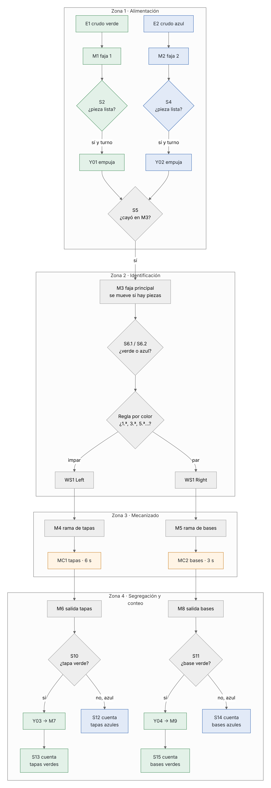
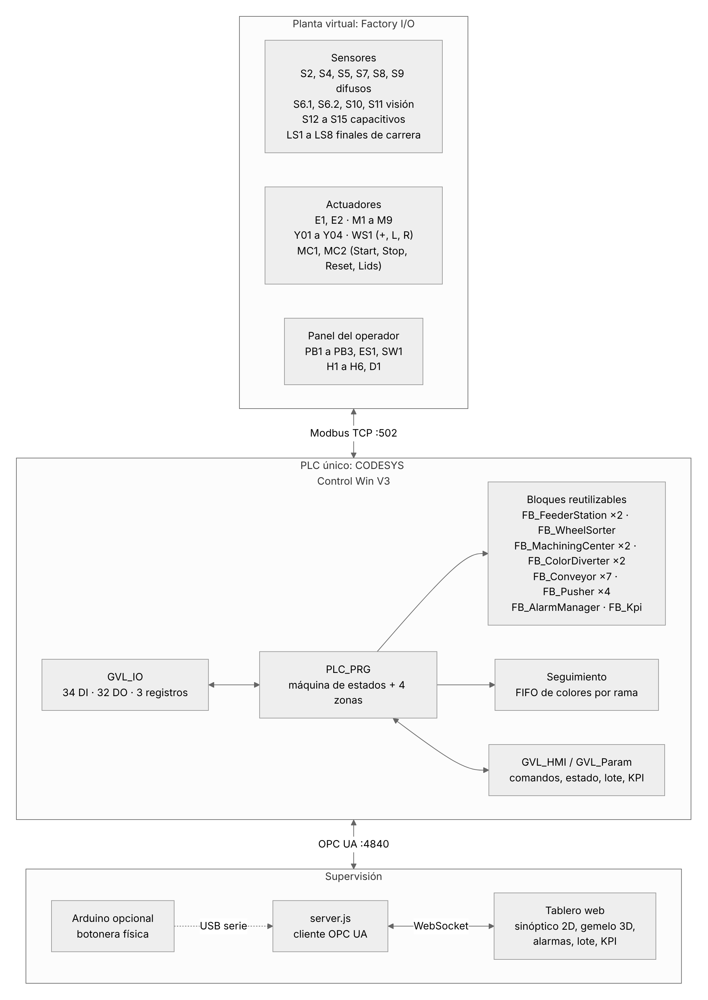
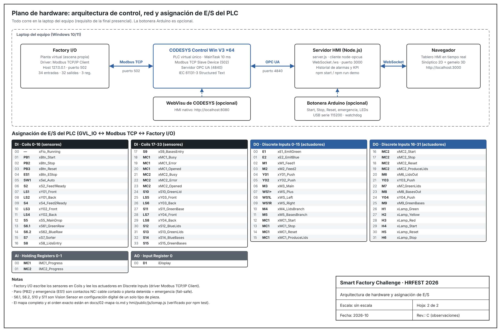
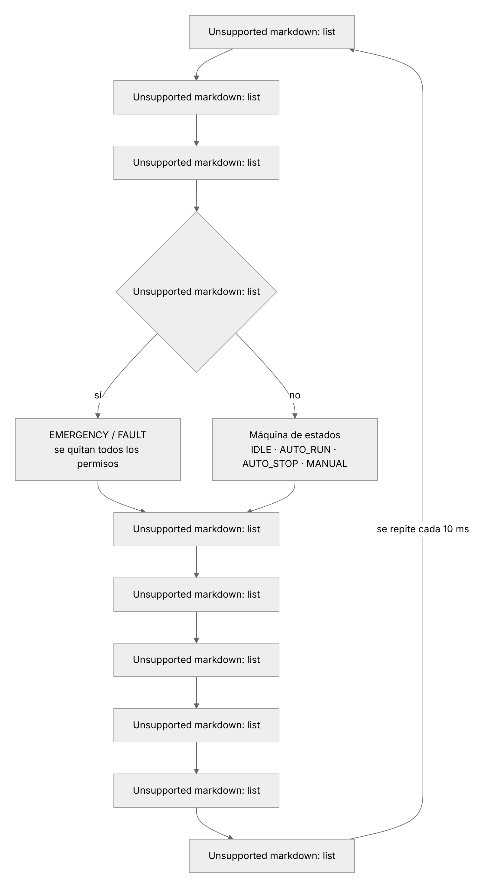
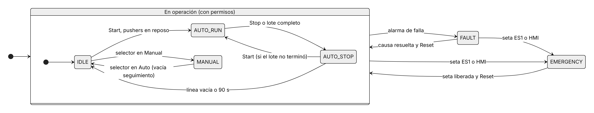
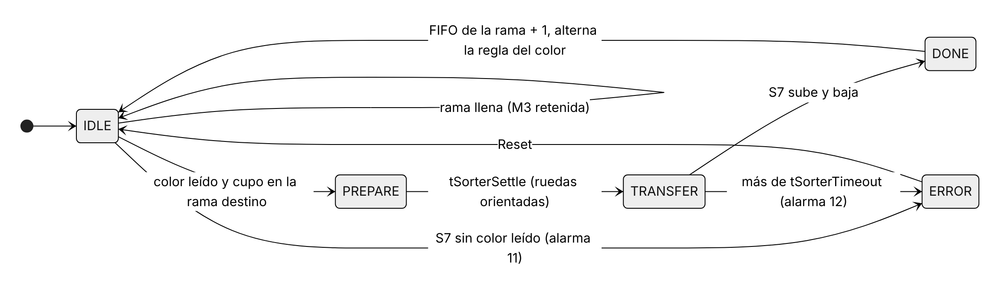

# 1. Arquitectura de la solución

## 1.1 Proceso que se automatiza

Una celda de manufactura que **transforma crudos en productos** y los **clasifica por color**,
controlada por **un solo PLC**. Se organiza en cuatro zonas:


| Zona | Qué ocurre | Equipos |
|---|---|---|
| **1. Alimentación** | E1 emite crudo verde en la faja 1 (M1) y E2 crudo azul en la faja 2 (M2). Cuando S2/S4 detecta una pieza lista, el pusher Y01/Y02 la transfiere a la faja principal y S5 confirma la caída | E1, E2, M1, M2, S2, S4, Y01, Y02, S5 |
| **2. Identificación** | M3 lleva la pieza al punto de lectura. S6.1 (crudo verde) o S6.2 (crudo azul) identifican el color y el wheel sorter WS1 la envía a la rama de tapas o de bases según la **regla de alternancia por color** | M3, S6.1, S6.2, WS1, S7 |
| **3. Mecanizado** | Cada rama acerca la pieza a su centro de mecanizado: MC1 produce **tapas** (6 s) y MC2 produce **bases** (3 s) | M4, M5, S8, S9, MC1, MC2 |
| **4. Segregación y conteo** | La faja de salida lleva el producto **azul** de largo. Un sensor de visión detecta el **verde** y un pusher lo desvía a su faja. Un sensor capacitivo cuenta cada producto al final | M6, M8, S10, S11, Y03, Y04, M7, M9, S12 a S15 |



### Regla del wheel sorter

> Si el crudo es **verde**, va a la faja de **tapas** si es el primer verde, o a **bases** si el
> anterior ya fue a tapas. Lo mismo para el **azul**, de forma independiente.

Resultado: de cada color salen tantas tapas como bases (±1), y cada máquina recibe los dos colores.
La prueba automática verifica la secuencia exacta pieza por pieza.

## 1.2 Componentes y comunicación





Se usan **los dos protocolos** que permite el reto, cada uno donde aporta más:

- **Modbus TCP** entre Factory I/O y el PLC: intercambio rápido de 34 entradas, 32 salidas y 3 registros.
- **OPC UA** entre el PLC y el tablero: variables con nombre y tipo (`GVL_HMI.rPPM`, `GVL_IO.xM3_Main`…),
  sin mapear direcciones a mano.

## 1.3 Estructura del programa del PLC

```
plc/codesys/
├── 01_DUT   E_MachineState · E_Color · E_Branch · E_SorterStep · E_PusherStep · E_AlarmClass · ST_Alarm · ST_Fifo
├── 02_GVL   GVL_IO (imagen de E/S) · GVL_HMI (comandos y estado) · GVL_Param (ajustes) · GVL_Alarm
├── 03_FUN   FC_ColorFromSensors · FC_FifoPush · FC_FifoPop · FC_FifoClear · FC_FifoPack
├── 04_FB    FB_Pusher · FB_Conveyor · FB_FeederStation · FB_WheelSorter · FB_MachiningCenter
│            FB_ColorDiverter · FB_AlarmManager · FB_Kpi
└── 05_PRG   PLC_PRG: 10 secciones, una por responsabilidad
```



| Bloque | Responsabilidad | Instancias |
|---|---|---|
| `FB_Pusher` | Ciclo extender/retraer con finales de carrera y vigilancia de tiempo | 4 (dentro de las estaciones) |
| `FB_Conveyor` | Faja con modo auto/manual, **marcha por demanda** y retención | 7 (M3 a M9) |
| `FB_FeederStation` | Faja alimentadora + centrado + pusher de transferencia | 2 (M1/Y01, M2/Y02) |
| `FB_WheelSorter` | Regla de alternancia por color y secuencia del Pop Up Wheel Sorter | 1 |
| `FB_MachiningCenter` | Start/Stop/Reset, eventos de carga y fin, ocupación (%) | 2 (MC1, MC2) |
| `FB_ColorDiverter` | Detección del verde, centrado, retención de la faja y empuje | 2 (Y03, Y04) |
| `FB_AlarmManager` | 24 alarmas enclavadas con reconocimiento | 1 |
| `FB_Kpi` | Conteo por producto, productos/min, ciclo, disponibilidad | 1 |

Las dos fajas alimentadoras y las dos líneas (tapas y bases) son **arreglos de instancias**: la
lógica se escribe una vez dentro de un `FOR k := 1 TO 2`. Agregar una tercera línea en la final es
cambiar `N_LINES` y mapear sus E/S.

## 1.4 Máquinas de estados



`EMERGENCY` tiene prioridad sobre cualquier estado: se evalúa antes que la máquina de estados y
retira los permisos de todos los equipos en el mismo ciclo. `AUTO_STOP` es una **parada
controlada**: deja de entrar material y termina lo que está en proceso.



## 1.5 Seguimiento de piezas

El PLC no "ve" las piezas: ve sensores. Por eso lleva la cuenta de cada tramo:

| Tramo | Contador | Entra con | Sale con |
|---|---|---|---|
| M3 | `iOnMain` | Flanco de S5 | Sorter `xDone` |
| M4 / M5 | FIFO de colores `aBranch[k]` | Sorter `xDone` (+ color) | Flanco de bajada de S8/S9 (el robot la toma) |
| MC1 / MC2 | `aeMcColor[k]` | Carga | Flanco de bajada de *Is Busy* |
| M6 / M8 | `aiOnOut[k]` | Fin de mecanizado | Y03/Y04 empuja o S12/S14 la cuenta |
| M7 / M9 | `aiOnGreen[k]` | Y03/Y04 terminó | S13/S15 la cuenta |

Estos contadores deciden qué fajas se mueven (ahorro de energía), si una rama tiene cupo y cuándo
la línea quedó vacía en una parada controlada. Tras operar en manual se vacían, porque las piezas
pudieron moverse a mano.

## 1.6 Gemelo digital y pruebas

La lógica del PLC tiene un **espejo 1:1 en JavaScript** ([`control.js`](../hmi/public/js/control.js)):
mismos bloques, mismas secciones, mismo orden. Junto con un modelo físico de la escena
([`plant.js`](../hmi/public/js/plant.js)) forma un gemelo digital que se usa para:

- la **demo** del tablero sin PLC ni Factory I/O (`npm run demo` o GitHub Pages);
- las **pruebas automáticas** (`npm test`), que verifican secuencia, regla del sorter, lote,
  emergencia, fallas y robustez frente a parámetros extremos;
- el **PLC simulado por OPC UA** (`npm run mock-plc`), para probar el tablero como si fuera CODESYS.

Una prueba de coherencia compara automáticamente los archivos `.st` con el tablero: nombres y
direcciones de `GVL_IO`, variables que lee el HMI, parámetros y alarmas. Si alguien cambia el PLC
y olvida el tablero (o al revés), la integración continua lo detecta.

## 1.7 Decisiones de diseño

| Decisión | Por qué |
|---|---|
| **Un solo PLC** con estaciones en arreglos | Una sola lógica para las dos fajas y las dos líneas: menos código, cero duplicación |
| Confirmación de cada transferencia con **S5** | Un empuje que no llega a la faja principal se detecta en 4 s, no cuando ya hay un choque |
| **Turno alterno** + separación mínima en la unión | Ninguna faja acapara la línea; las piezas no chocan (0 choques en las pruebas) |
| Lectura de color **antes** del sorter y orientación de ruedas **antes** de que llegue la pieza | El sorter nunca gira con una pieza encima |
| **Cupo por rama** (`iBranchCapacity`) | Si una máquina se atrasa, la pieza espera en M3 en vez de saturar la rama |
| Fajas con **marcha por demanda** | Solo se mueven con piezas: ahorro de energía y desgaste, como pide el borrador del equipo |
| Emergencia y Stop **NC** con `XOR` configurable | Cable cortado o planta desconectada = emergencia (fail-safe) |
| Alarmas **enclavadas**, Reset solo sin causa | Comportamiento estándar industrial (ISA-18.2) |
| **Handshake** de comandos y **heartbeat** | Ningún comando del HMI se pierde; el tablero detecta si el PLC se detuvo |
| Tablero con criterio **ISA-101** | Fondo neutro, color solo para lo que requiere atención |
