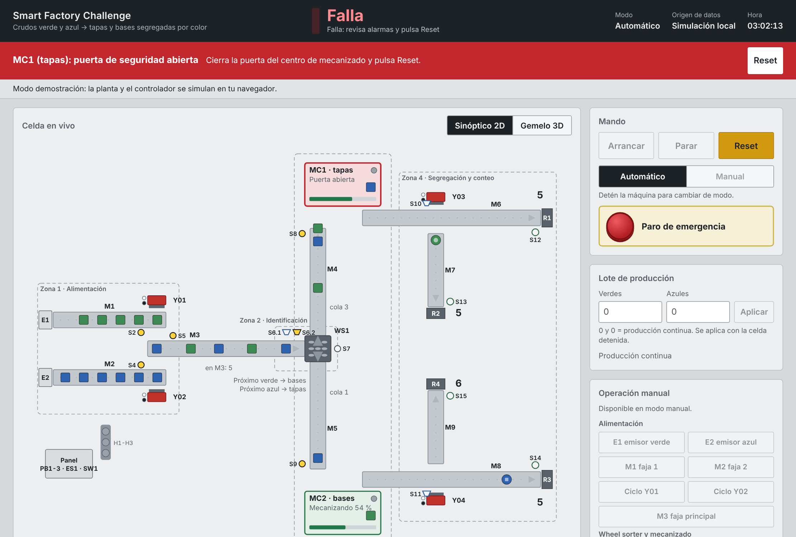

# 6. Protocolo de pruebas

## 6.1 Pruebas automáticas

La lógica del PLC tiene un espejo exacto en JavaScript (`hmi/public/js/control.js`) que se prueba
contra un modelo de la planta (`plant.js`). GitHub Actions las ejecuta en cada `push` y en cada
*pull request*: un cambio que rompa la secuencia no se puede integrar sin que se vea.

```bash
cd hmi
npm test
```

| Prueba | Qué valida | Observación / base |
|---|---|---|
| GVL_IO coincide con iomap.js | Nombre, orden, tipo y dirección Modbus de las 69 señales | Calidad del código |
| Variables del tablero existen en el PLC | Toda lectura y escritura OPC UA apunta a una variable real | HMI |
| Parámetros del espejo = GVL_Param | Mismos tiempos y capacidades en CODESYS y en el gemelo | Calidad |
| Alarmas del tablero = alarmas del PLC | Mismo número, orden y clase | Alarmas |
| Produce sin errores (4 min) | Cero productos en la salida equivocada, cero choques, ≥ 12 productos/min, sin alarmas | O16, O17, optimización |
| Regla del wheel sorter | Secuencia exacta tapas, bases, tapas… para **cada** color; tapas = bases (±1) | O13, O14 |
| Unión alterna las fajas | Ambas fajas alimentan, reparto equilibrado, cero choques (3 semillas) | O1 a O10 |
| Lote X verdes e Y azules | Se alimentan exactamente X e Y, todo sale como producto y la celda vuelve a IDLE | O18 |
| Parada controlada | No entra material nuevo, la línea se vacía, todo lo alimentado sale | Funcionalidad |
| Paro de emergencia | Todas las salidas en reposo, MC reciben Stop, exige Reset, reanuda sin perder seguimiento | Alarmas |
| Y01 trabado | Alarma 2 por tiempo excedido, FAULT, recuperación con Reset | Alarmas |
| Pieza no identificada | Alarma 11 en el sorter, recuperación al retirarla | Alarmas |
| Error y puerta de MC | Alarmas 13 y 16 | Alarmas |
| Atasco en S15 | Alarma 20 | Alarmas |
| Modo manual | Los mandos manuales solo actúan en MANUAL y se apagan al salir | Manual/automático |
| Fajas por demanda | Las fajas sin piezas no se mueven | O9 |
| Robustez | 8 combinaciones de parámetros y ritmos de emisión extremos, 5 min cada una, sin bloqueos | Funcionalidad |

En la demo del tablero, el panel *Pruebas de falla* provoca las mismas fallas a mano. Ejemplo:
puerta de MC1 abierta durante el mecanizado → alarma 15, estado FAULT, MC1 en rojo y botón Reset resaltado.



### Prueba de comunicación OPC UA sin CODESYS

```bash
npm run mock-plc     # terminal 1: servidor OPC UA con nombres estilo CODESYS y la celda simulada
npm start            # terminal 2: el tablero se conecta como si fuera el PLC real
```

## 6.2 Pruebas en planta (Factory I/O + CODESYS)

Marca cada prueba antes de grabar el video.

| ID | Procedimiento | Resultado esperado | OK |
|---|---|---|---|
| P01 | Arranque en frío | IDLE, torre amarilla, sin alarmas | ☐ |
| P02 | Selector Auto + Start | AUTO_RUN, torre verde, E1/E2 emiten, M1/M2 avanzan | ☐ |
| P03 | Pieza en S2 y en S4 a la vez | Y01 e Y02 se alternan, nunca a la vez; S5 confirma cada caída | ☐ |
| P04 | Primer verde, segundo verde, tercero… | Tapas, bases, tapas… (mirar `fbSorter.axNextToBases[1]`) | ☐ |
| P05 | Igual con azules | Alternancia independiente del verde | ☐ |
| P06 | 5 minutos en automático | Tapas azules en S12, tapas verdes en S13, bases azules en S14, bases verdes en S15 | ☐ |
| P07 | Lote de 3 verdes y 2 azules | Entran exactamente 3 y 2; al terminar queda en IDLE con "Lote completado" | ☐ |
| P08 | Stop en producción | No entra material nuevo, se terminan las piezas en proceso, pasa a IDLE | ☐ |
| P09 | Emergencia en plena marcha | Todo se detiene, MC1/MC2 en Stop, torre roja fija | ☐ |
| P10 | Reset con la emergencia aún pulsada | No se rearma | ☐ |
| P11 | Liberar emergencia + Reset + Start | Reanuda sin perder el seguimiento | ☐ |
| P12 | Bloquear Y01 con una caja | Alarma 2 tras 3 s, FAULT | ☐ |
| P13 | Retirar a mano una pieza recién empujada | Alarma 10 (S5 no confirma) | ☐ |
| P14 | Poner una pieza de metal en M3 | Alarma 11 en el sorter | ☐ |
| P15 | Abrir la puerta de MC1 con una pieza en mecanizado | Alarma 15 | ☐ |
| P16 | Quitar el removedor R4 | Alarma 20 (atasco en S15) tras 5 s | ☐ |
| P17 | Selector Manual: mover cada faja, el sorter y cada pusher desde el tablero | Cada actuador responde; en Auto no responden | ☐ |
| P18 | Pausar Factory I/O | Aviso 24 en el tablero | ☐ |
| P19 | Start desde el tablero web | Arranca igual que con el botón físico | ☐ |
