# 8. Planos y diagramas

Todos los diagramas describen **la misma celda**: dos fajas alimentadoras (verde y azul), una faja
principal con identificación por visión, un wheel sorter, dos centros de mecanizado (tapas y bases)
y segregación del producto por color, controlados por **un solo PLC**.

- Los planos se generan desde la geometría y el mapa de E/S del código: `cd hmi && npm run plano`.
- Los diagramas de flujo son Mermaid (`docs/diagramas/*.mmd`): GitHub los dibuja solos y en VS Code se ven
  con la extensión *Markdown Preview Mermaid Support*. Para regenerar las imágenes: `npm run diagramas`.

| Diagrama | Qué muestra | Imagen | Fuente |
|---|---|---|---|
| Plano de distribución | Vista superior a escala, códigos de cada equipo, lista de dispositivos y observaciones aplicadas | [PNG](img/plano-celda.png) · [SVG](img/plano-celda.svg) | `tools/generar-plano.mjs` |
| Plano de hardware | Arquitectura de control y red, y asignación de E/S del PLC | [PNG](img/plano-hardware.png) · [SVG](img/plano-hardware.svg) | `tools/generar-plano.mjs` |
| Componentes | Qué partes tiene el sistema y por qué protocolo se comunican | [PNG](img/diagrama-componentes.png) | `diagramas/componentes.mmd` |
| Flujo general del proceso | El recorrido de una pieza por las cuatro zonas (versión limpia del borrador del equipo) | [PNG](img/diagrama-flujo-general.png) | `diagramas/flujo-general.mmd` |
| Flujo de la alimentación | Cómo decide el PLC qué faja empuja (Y01/Y02), la confirmación con S5 y el lote | [PNG](img/diagrama-flujo-alimentacion.png) | `diagramas/flujo-alimentacion.mmd` |
| Flujo del wheel sorter | Identificación con S6.1/S6.2 y regla de alternancia por color | [PNG](img/diagrama-flujo-wheel-sorter.png) | `diagramas/flujo-wheel-sorter.mmd` |
| Flujo de mecanizado y segregación | Rama, centro de mecanizado, desvío del verde y conteo | [PNG](img/diagrama-flujo-mecanizado.png) | `diagramas/flujo-mecanizado.mmd` |
| Ciclo del PLC | El orden en que se ejecuta PLC_PRG cada 10 ms | [PNG](img/diagrama-ciclo-plc.png) | `diagramas/ciclo-plc.mmd` |
| Estados de la celda | Modos de la máquina y qué los cambia | [PNG](img/diagrama-estados.png) | `diagramas/estados.mmd` |
| Estados del wheel sorter | Secuencia interna de FB_WheelSorter | [PNG](img/diagrama-estados-sorter.png) | `diagramas/estados-sorter.mmd` |
| Secuencia de una pieza | Intercambio de señales entre la planta y los bloques para un crudo verde | [PNG](img/diagrama-secuencia-pieza.png) | `diagramas/secuencia-pieza.mmd` |
| Gestión de alarmas | Clases de alarma, efecto y recuperación | [PNG](img/diagrama-flujo-alarmas.png) | `diagramas/flujo-alarmas.mmd` |

## 8.1 Plano de distribución

## 8.2 Plano de hardware y asignación de E/S

## 8.3 Componentes

Qué partes tiene el sistema y por qué protocolo se comunican.

Fuente Mermaid

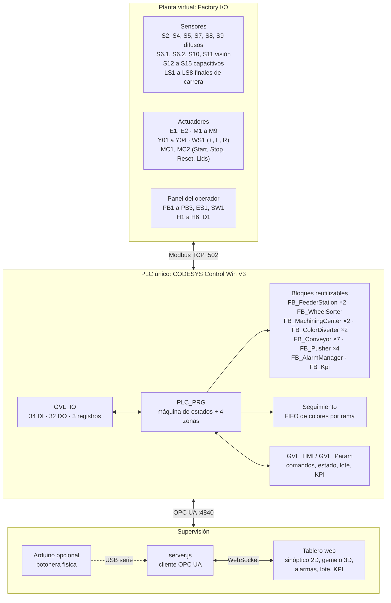

## 8.4 Flujo general del proceso

El recorrido de una pieza por las cuatro zonas (versión limpia del borrador del equipo).

Fuente Mermaid

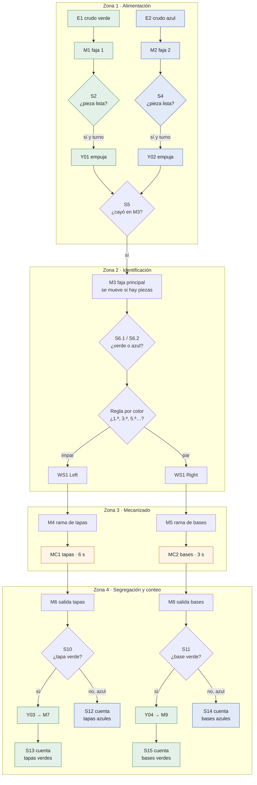

## 8.5 Flujo de la alimentación

Cómo decide el PLC qué faja empuja (Y01/Y02), la confirmación con S5 y el lote.

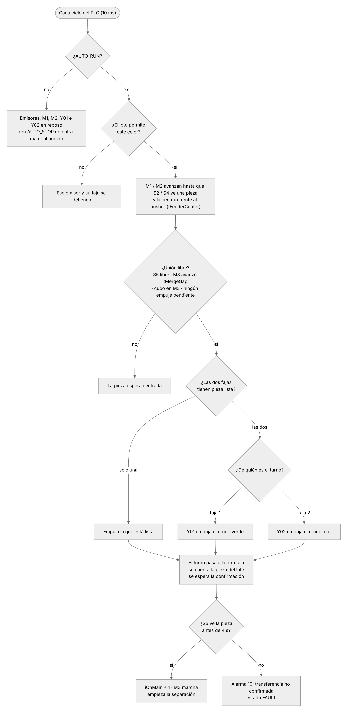

Fuente Mermaid

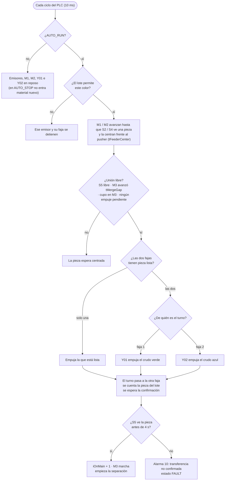

## 8.6 Flujo del wheel sorter

Identificación con S6.1/S6.2 y regla de alternancia por color.

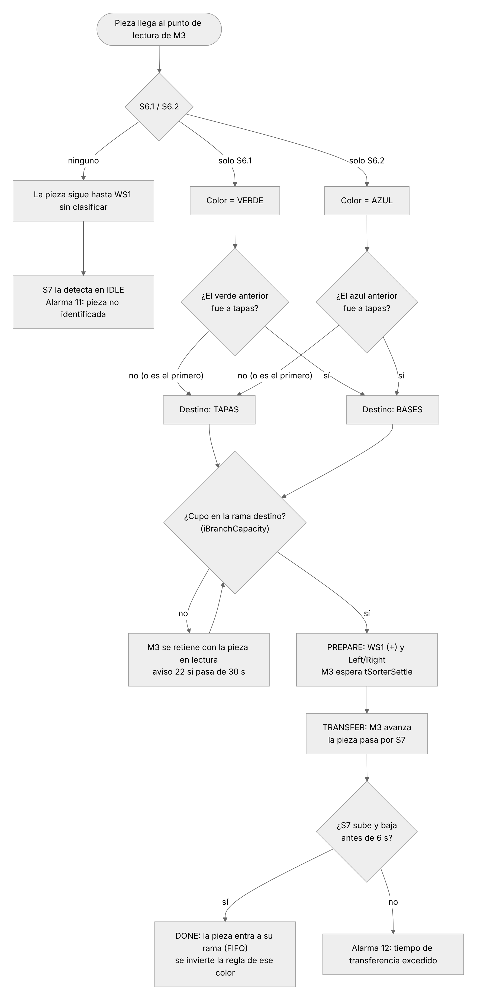

Fuente Mermaid

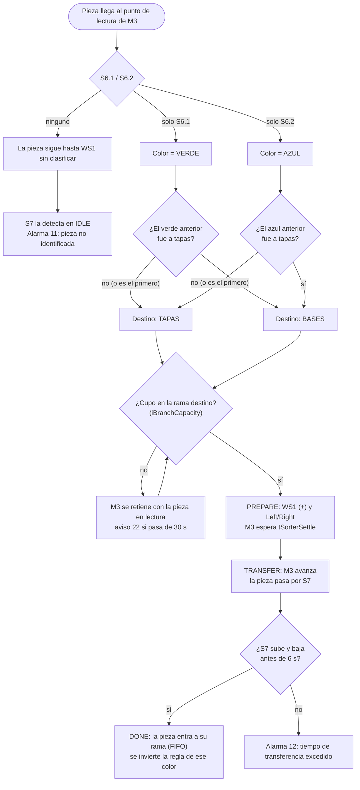

## 8.7 Flujo de mecanizado y segregación

Rama, centro de mecanizado, desvío del verde y conteo.

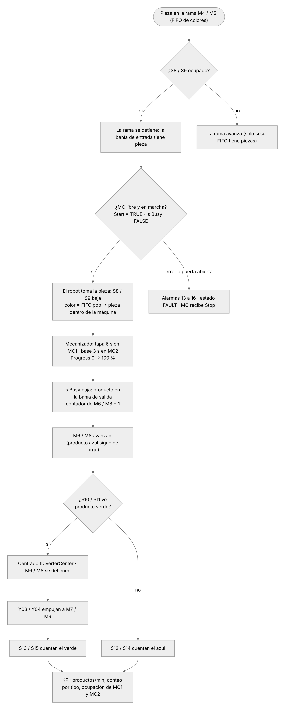

Fuente Mermaid

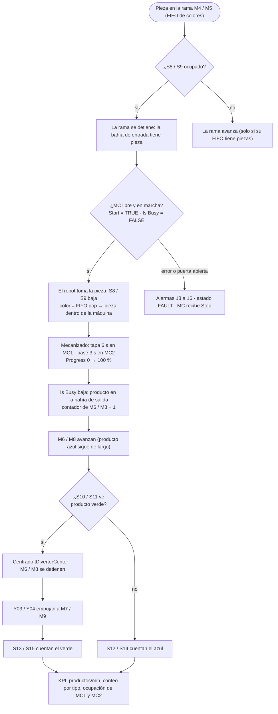

## 8.8 Ciclo del PLC

El orden en que se ejecuta PLC_PRG cada 10 ms.

Fuente Mermaid

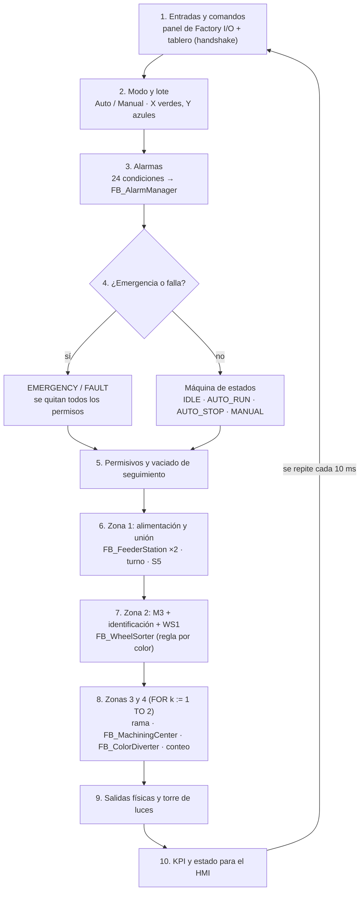

## 8.9 Estados de la celda

Modos de la máquina y qué los cambia.

Fuente Mermaid

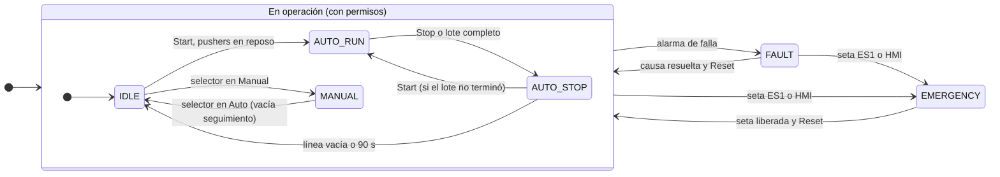

## 8.10 Estados del wheel sorter

Secuencia interna de FB_WheelSorter.

Fuente Mermaid

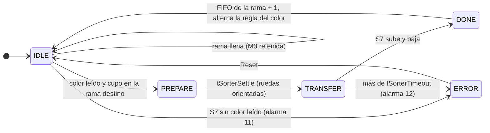

## 8.11 Secuencia de una pieza

Intercambio de señales entre la planta y los bloques para un crudo verde.

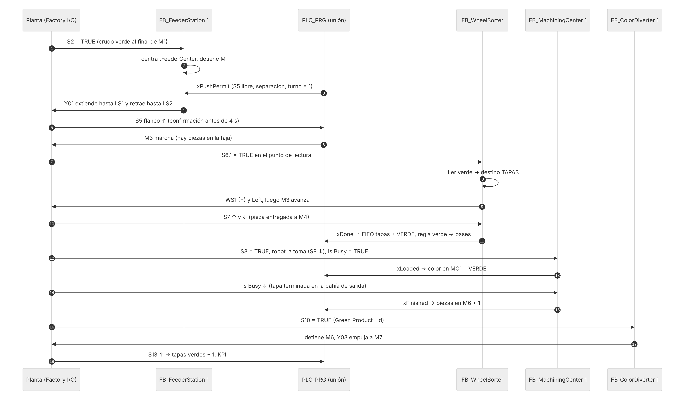

Fuente Mermaid

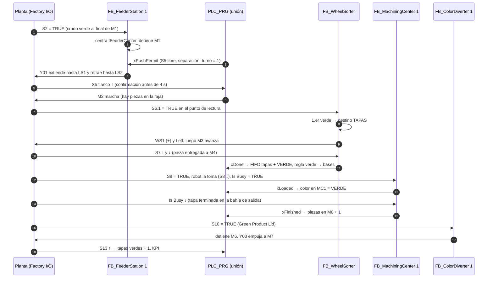

## 8.12 Gestión de alarmas

Clases de alarma, efecto y recuperación.

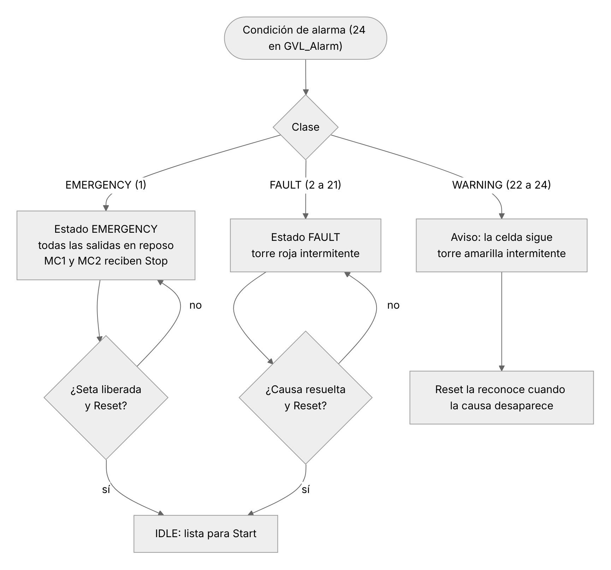

Fuente Mermaid

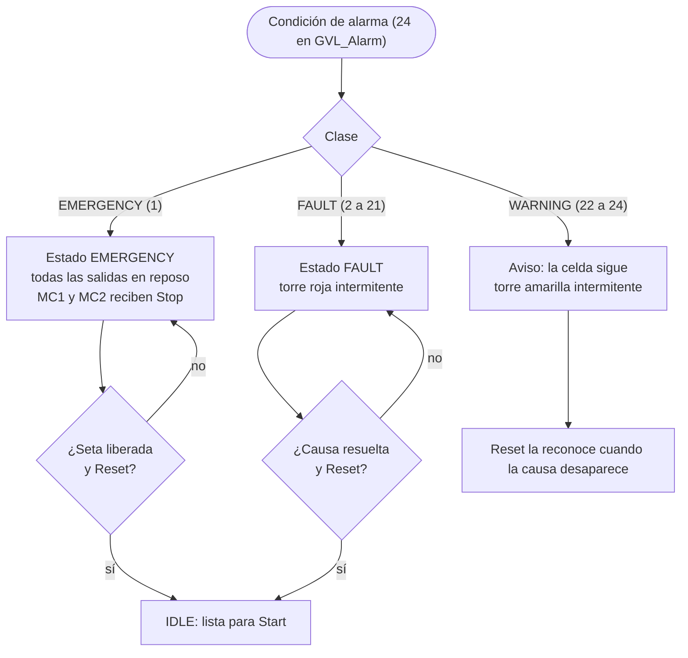

## 8.13 Borrador original del equipo

El diagrama de flujo del proceso parte de este borrador, que se respetó en la solución (zonas,
sensores capacitivos de conteo, regla del wheel sorter y alimentación por cantidades).

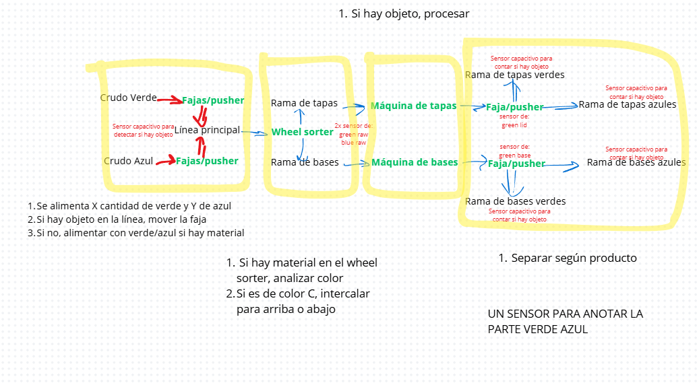

Referencia visual de una celda en Factory I/O usada como modelo para el gemelo 3D:

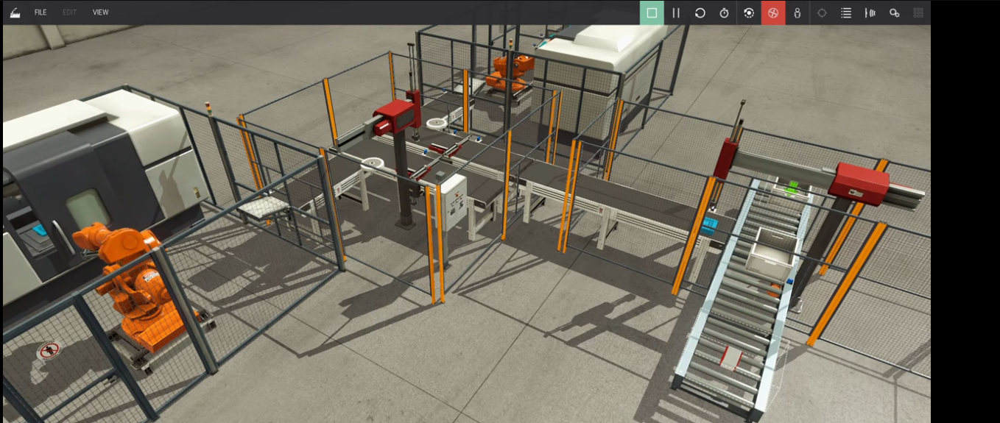
